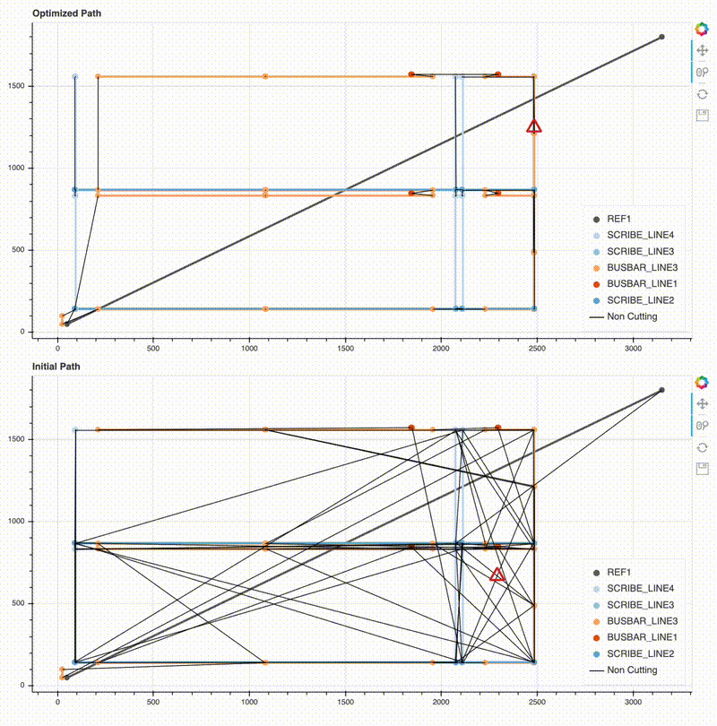

# CNC Path Optimization

Discover the most efficient cutting route for CNC machines using a genetic algorithm. This project focuses on optimizing tool paths to minimize machining time and improve overall efficiency. The algorithm simulates the process of natural selection, evolving the path over multiple generations to find the best possible solution.

